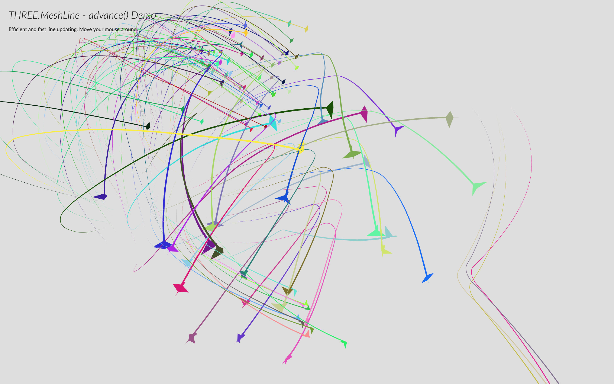

# MeshLine

A mesh replacement for `THREE.Line`. Instead of using GL_LINE, it uses a strip of billboarded triangles. This is a fork of [spite/THREE.MeshLine](https://github.com/spite/THREE.MeshLine), previously maintained by studio [Utsuboco](https://github.com/utsuboco).

<p align="center">
  
  
  
  
  
  
</p>

### How to use

```
npm install meshline
```

```jsx
import * as THREE from 'three'
import { MeshLineGeometry, MeshLineMaterial } from 'meshline'
```

##### Create an array of 3D coordinates

First, create the list of numbers that will define the 3D points for the line.

```jsx
const points = []
for (let j = 0; j < Math.PI; j += (2 * Math.PI) / 100) {
  points.push(Math.cos(j), Math.sin(j), 0)
}
```

##### Create a MeshLine and assign the points

Once you have that, you can create a new `MeshLineGeometry`, and call `.setPoints()` passing the list of points.

```jsx
const geometry = new MeshLineGeometry()
geometry.setPoints(points)
```

Note: `.setPoints` accepts a second parameter, which is a function to define the width in each point along the line. By default that value is 1, making the line width 1 \* lineWidth in the material.

```jsx
// p is a decimal percentage of the number of points
// ie. point 200 of 250 points, p = 0.8
geometry.setPoints(points, (p) => 2) // makes width 2 * lineWidth
geometry.setPoints(points, (p) => 1 - p) // makes width taper
geometry.setPoints(points, (p) => 2 + Math.sin(50 * p)) // makes width sinusoidal
```

Cou can also provide a `BufferGeometry` by calling `.setGeometry()` instead.

```jsx
geometry.setGeometry(myGeometry)
geometry.setGeometry(myGeometry, (p) => 2)
```

##### Create a MeshLineMaterial

`MeshLineGeometry` needs to be paired with `MeshLineMaterial`.

```jsx
const material = new MeshLineMaterial(options)
```

By default it's a white material of width 1 unit.

`MeshLineMaterial` has several attributes to control the appereance of the `MeshLine`:

- `map` - a `THREE.Texture` to paint along the line (requires `useMap` set to true)
- `useMap` - tells the material to use `map` (0 - solid color, 1 use texture)
- `alphaMap` - a `THREE.Texture` to use as alpha along the line (requires `useAlphaMap` set to true)
- `useAlphaMap` - tells the material to use `alphaMap` (0 - no alpha, 1 modulate alpha)
- `repeat` - THREE.Vector2 to define the texture tiling (applies to map and alphaMap)
- `color` - `THREE.Color` to paint the line width, or tint the texture with
- `opacity` - alpha value from 0 to 1 (requires `transparent` set to `true`)
- `alphaTest` - cutoff value from 0 to 1
- `dashArray` - the length and space between dashes. (0 - no dash)
- `dashOffset` - defines the location where the dash will begin. Ideal to animate the line.
- `dashRatio` - defines the ratio between that is visible or not (0 - more visible, 1 - more invisible).
- `resolution` - `THREE.Vector2` specifying the canvas size (REQUIRED)
- `sizeAttenuation` - constant lineWidth regardless of distance (1 is 1px on screen) (0 - attenuate, 1 - don't)
- `lineWidth` - float defining width (if `sizeAttenuation` is true, it's world units; else is screen pixels)

If you're rendering transparent lines or using a texture with alpha map, you should set `depthTest` to `false`, `transparent` to `true` and `blending` to an appropriate blending mode, or use `alphaTest`.

##### Use MeshLine and MeshLineMaterial to create a THREE.Mesh

Finally, we create a mesh and add it to the scene:

```jsx
const mesh = new THREE.Mesh(geometry, material)
scene.add(mesh)
```

##### Add raycast support

Raycast can be optionally added by overwriting `mesh.raycast` with the one that meshline provides.

```jsx
import { raycast } from 'meshline'

mesh.raycast = raycast
```

### Declarative use

Meshline can be used declaritively. This is how it would look like in [react-three-fiber](https://github.com/pmndrs/react-three-fiber). You can try it live [here](https://codesandbox.io/s/react-three-fiber-three.meshline-example-vl221).

`MeshLineGeometry` has two convenience setter/getters, `points`, which accepts a `Float32Array` or an `Array<number>`, and `geometry`, which accepts a `BufferGeometry`. You don't have to explicitely call `.setPoints` or `.setGeometry`.

```jsx
import { Canvas, extend } from '@react-three/fiber'
import { MeshLineGeometry, MeshLineMaterial, raycast } from 'meshline'

extend({ MeshLine, MeshLineMaterial })

function Line({ points, width, color }) {
  return (
    <Canvas>
      <mesh raycast={raycast}>
        <meshLineGeometry points={points} />
        <meshLineMaterial
          transparent
          depthTest={false}
          lineWidth={width}
          color={color}
          dashArray={0.05}
          dashRatio={0.95}
        />
      </mesh>
    </Canvas>
  )
}
```

Dynamic line widths can be set along each point using the `widthCallback` prop.

```jsx
<meshLineGeometry points={points} widthCallback={(p) => p * Math.random()} />
```

##### Types

Add these declarations to your entry point.

```tsx
import { Object3DNode, MaterialNode } from '@react-three/fiber'

declare module '@react-three/fiber' {
  interface ThreeElements {
    meshLineGeometry: Object3DNode<MeshLineGeometry, typeof MeshLineGeometry>
    meshLineMaterial: MaterialNode<MeshLineMaterial, typeof MeshLineMaterial>
  }
}
```

### References

- [Drawing lines is hard](http://mattdesl.svbtle.com/drawing-lines-is-hard)
- [WebGL rendering of solid trails](http://codeflow.org/entries/2012/aug/05/webgl-rendering-of-solid-trails/)
- [Drawing Antialiased Lines with OpenGL](https://www.mapbox.com/blog/drawing-antialiased-lines/)
