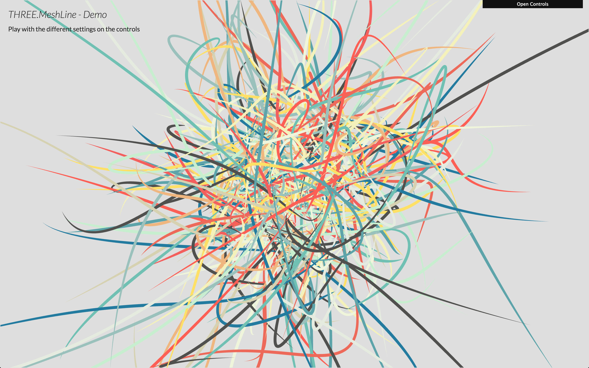
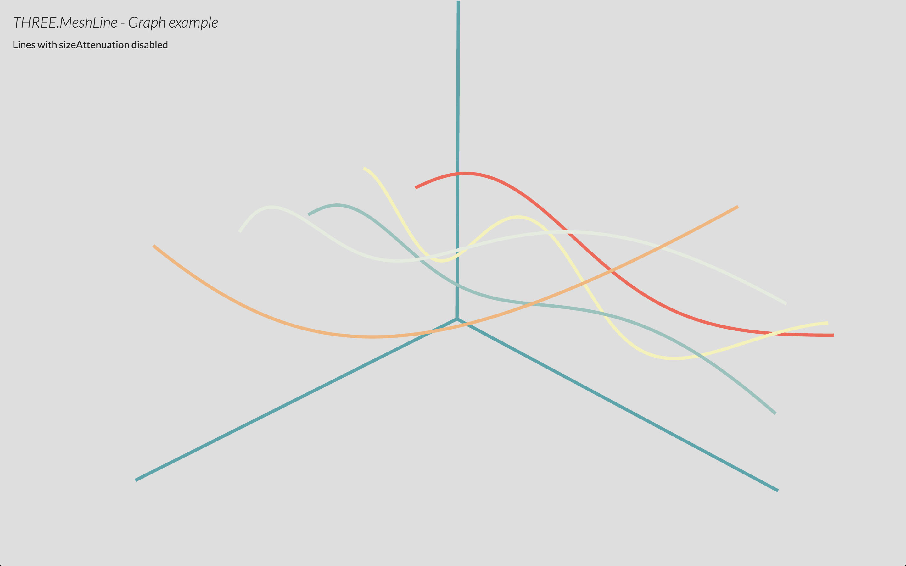
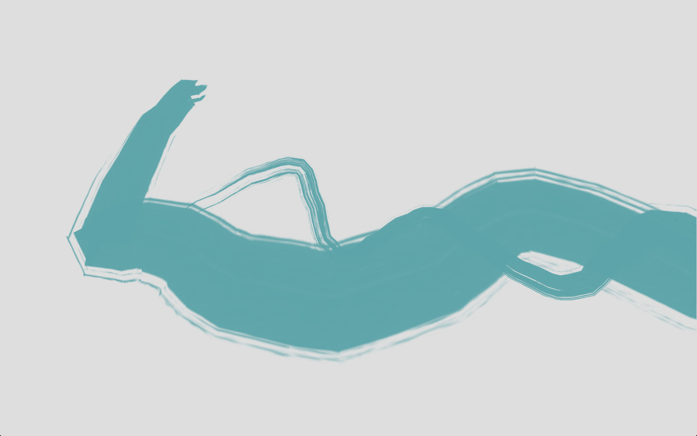
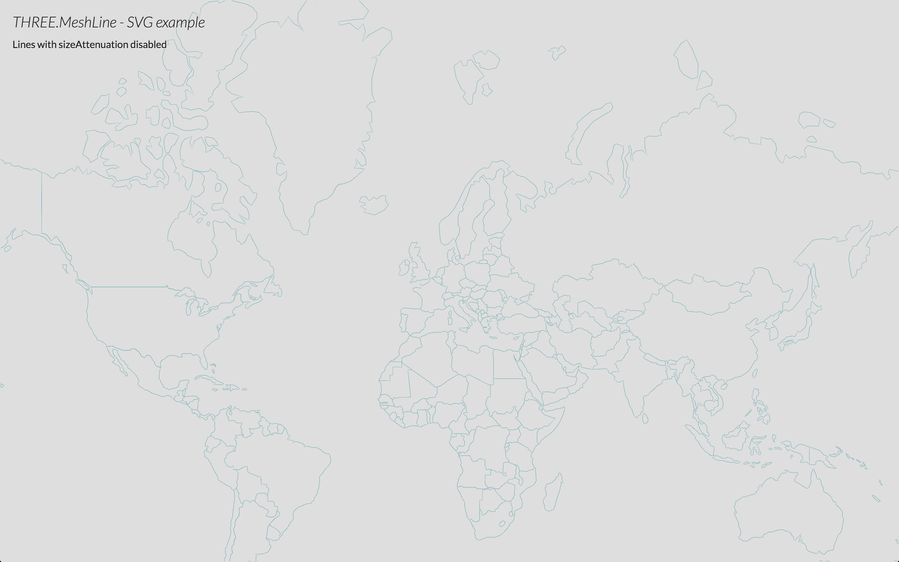
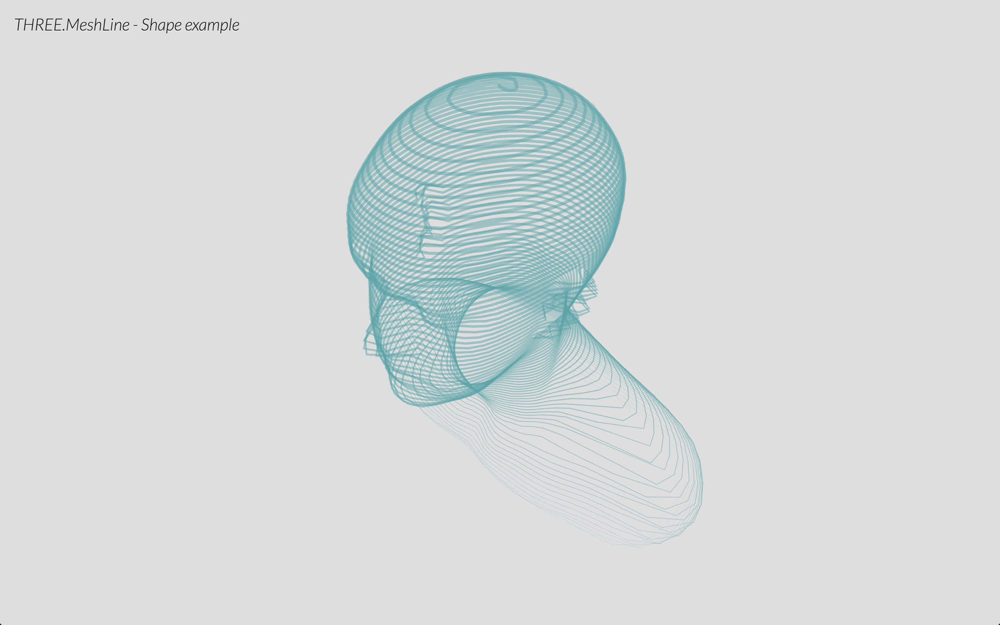

# THREE.MeshLine
Mesh replacement for ```THREE.Line```

Instead of using GL_LINE, it uses a strip of triangles billboarded. Some examples:

[](https://www.clicktorelease.com/code/THREE.MeshLine/demo/index.html)
[](https://www.clicktorelease.com/code/THREE.MeshLine/demo/graph.html)
[](https://www.clicktorelease.com/code/THREE.MeshLine/demo/spinner.html)
[](https://www.clicktorelease.com/code/THREE.MeshLine/demo/svg.html)
[](https://www.clicktorelease.com/code/THREE.MeshLine/demo/shape.html)

* [Demo](https://www.clicktorelease.com/code/THREE.MeshLine/demo/index.html): play with the different settings of materials
* [Graph](https://www.clicktorelease.com/code/THREE.MeshLine/demo/graph.html): example of using ```THREE.MeshLine``` to plot graphs
* [Spinner](https://www.clicktorelease.com/code/THREE.MeshLine/demo/spinner.html): example of dynamic ```THREE.MeshLine``` with texture
* [SVG](https://www.clicktorelease.com/code/THREE.MeshLine/demo/svg.html): example of ```THREE.MeshLine``` rendering SVG Paths
* [Shape](https://www.clicktorelease.com/code/THREE.MeshLine/demo/shape.html): example of ```THREE.MeshLine``` created from a mesh


#### How to use

* Create and populate a geometry
* Create a THREE.MeshLine and assign the geometry
* Create a THREE.MeshLineMaterial
* Use THREE.MeshLine and THREE.MeshLineMaterial to create a THREE.Mesh

##### Create and populate a geometry #####

First, create the list of vertices that will define the line. ```THREE.MeshLine``` accepts ```THREE.Geometry``` (looking up the ```.vertices``` in it) and ```Array```/```Float32Array```. ```THREE.BufferGeometry``` coming soon, and may be others like ```Array``` of ```THREE.Vector3```.

````
var geometry = new THREE.Geometry();
for( var j = 0; j < Math.PI; j += 2 * Math.PI / 100 ) {
	var v = new THREE.Vector3( Math.cos( j ), Math.sin( j ), 0 );
	geometry.vertices.push( v );
}
````

##### Create a THREE.MeshLine and assign the geometry #####

Once you have that, you can create a new ```THREE.MeshLine```, and call ```.setGeometry()``` passing the vertices.

````
var line = new THREE.MeshLine();
line.setGeometry( geometry );
````

Note: ```.setGeometry``` accepts a second parameter, which is a function to define the width in each point along the line. By default that value is 1, making the line width 1 * lineWidth.

````
line.setGeometry( geometry, function( p ) { return 2; } ); // makes width 2 * lineWidth
line.setGeometry( geometry, function( p ) { return 1 - p; } ); // makes width taper
line.setGeometry( geometry, function( p ) { return 2 + Math.sin( 50 * p ); } ); // makes width sinusoidal
````

##### Create a THREE.MeshLineMaterial #####

A ```THREE.MeshLine``` needs a ```THREE.MeshLineMaterial```:

````
var material = new THREE.MeshLineMaterial();
````

By default it's a white material of width 1 unit.

```THREE.MeshLineMaterial``` has several attributes to control the appereance of the ```THREE.MeshLine```:

* ```map``` - a ```THREE.Texture``` to paint along the line (requires ```useMap``` set to true)
* ```useMap``` - tells the material to use ```map``` (0 - solid color, 1 use texture)
* ```color``` - ```THREE.Color``` to paint the line width, or tint the texture with
* ```opacity``` - alpha value from 0 to 1 (requires ```transparent``` set to ```true```)
* ```dashArray``` - THREE.Vector2 to define the dashing (NOT IMPLEMENTED YET)
* ```resolution``` - ```THREE.Vector2``` specifying the canvas size (REQUIRED)
* ```sizeAttenuation``` - makes the line width constant regardless distance (1 unit is 1px on screen) (0 - attenuate, 1 - don't attenuate)
* ```lineWidth``` - float defining width (if ```sizeAttenuation``` is true, it's world units; else is screen pixels)
* ```near``` - camera near clip plane distance  (REQUIRED if ```sizeAttenuation``` set to false)
* ```far``` - camera far clip plane distance  (REQUIRED if ```sizeAttenuation``` set to false)

If you're rendering transparent lines or using a texture with alpha map, you should set ```depthTest``` to ```false```, ```transparent``` to ```true``` and ```blending``` to ```THREE.AdditiveAlphaBlending```.

##### Use THREE.MeshLine and THREE.MeshLineMaterial to create a THREE.Mesh #####

Finally, we create a mesh and add it to the scene:

```
var mesh = new THREE.Mesh( line.geometry, material ); // this syntax could definitely be improved!
scene.add( mesh );
```

### TODO ###

* Better miters
* Proper sizes
* Support for dashArray

### Support ###

Tested successfully on

* Chrome OSX, Windows, Android
* Firefox OSX, Windows, Anroid
* Safari OSX, iOS
* Internet Explorer 11 (SVG and Shape demo won't work because they use Promises)
* Opera OSX, Windows

### References ###

* [Drawing lines is hard](http://mattdesl.svbtle.com/drawing-lines-is-hard)
* [WebGL rendering of solid trails](http://codeflow.org/entries/2012/aug/05/webgl-rendering-of-solid-trails/)
* [Drawing Antialiased Lines with OpenGL](https://www.mapbox.com/blog/drawing-antialiased-lines/)

#### License ####

MIT licensed

Copyright (C) 2015 Jaume Sanchez Elias, http://www.clicktorelease.com
